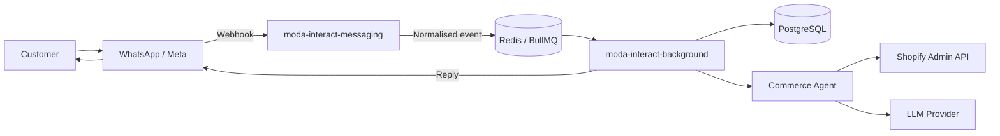

# Moda Interact Messaging

`moda-interact-messaging` is the messaging ingress service for the Moda Interact platform.


The service is built with React Router and runs independently from the main Shopify application so messaging traffic can be developed, deployed, and scaled separately.


It does **not** currently own:

- AI response generation
- conversation orchestration
- checkout recovery workflows
- Shopify product/order tooling
- long-running background jobs
- merchant billing
- Shopify webhook ingestion

Those responsibilities live in the other Moda Interact services.

## Architecture



The messaging service acts as an ingress boundary:

```text
WhatsApp webhook
      |
      v
moda-interact-messaging
      |
      +--> validate request
      |
      +--> parse message
      |
      +--> normalise event
      |
      v
BullMQ / Redis
      |
      v
moda-interact-background
```

Keeping the webhook ingress separate from the worker means the HTTP request can be acknowledged quickly while slower work happens asynchronously.

## Repository structure

```text
app/
├── app.css
├── lib/
│   ├── queues/
│   │   └── whatsapp.queue.ts
│   ├── redis/
│   │   └── redis.ts
│   └── types/
│       └── whatsapp.ts
│
├── routes/
│   ├── home.tsx
│   └── whatsapp.tsx
│
├── root.tsx
├── routes.ts
└── welcome/
```

### `app/routes/whatsapp.tsx`

Handles inbound WhatsApp webhook traffic.

This route should stay lightweight:

1. validate the webhook request
2. extract the relevant message data
3. convert the provider payload into the internal WhatsApp event shape
4. enqueue the event
5. return a response quickly

Business logic should not be performed directly inside the webhook request.

## Event flow

A typical inbound customer message follows this path:

```text
Customer sends WhatsApp message
        |
        v
Meta / WhatsApp webhook
        |
        v
POST /whatsapp
        |
        v
Normalise inbound payload
        |
        v
whatsapp.queue
        |
        v
Redis / BullMQ
        |
        v
WhatsApp worker
        |
        +--> resolve customer/conversation
        +--> persist inbound message
        +--> invoke commerce agent
        +--> use Shopify tools when required
        +--> generate response
        +--> send outbound WhatsApp reply
```

The worker-side behaviour is implemented in `moda-interact-background`, not in this repository.

## Why this is a separate service

WhatsApp webhook traffic has different operational characteristics from the Shopify merchant application.

Separating the ingress service gives Moda Interact:

- independent deployment
- independent scaling
- smaller failure boundaries
- fast webhook acknowledgement
- clearer ownership of provider-specific messaging concerns
- the ability to add other messaging channels later without coupling them to the Shopify UI

The HTTP service remains stateless where possible. Durable state is stored downstream in PostgreSQL, and asynchronous work is coordinated through Redis/BullMQ.

## Technology

- **TypeScript**
- **React Router**
- **Node.js**
- **Redis**
- **BullMQ**
- **WhatsApp Business Platform / Meta webhooks**

## Getting started

### Prerequisites

You will need:

- Node.js
- npm
- Redis
- WhatsApp/Meta webhook credentials for live integration, or a development/test payload source

### Install dependencies

```bash
npm install
```

### Environment

Create the environment variables required by the service.

Typical values include:

```bash
REDIS_URL=

# WhatsApp / Meta configuration
WHATSAPP_VERIFY_TOKEN=
WHATSAPP_APP_SECRET=
WHATSAPP_ACCESS_TOKEN=
WHATSAPP_PHONE_NUMBER_ID=
```

### Run locally

```bash
npm run dev
```

The React Router development server will start locally.

## WhatsApp webhook development

For Meta to call a local webhook, the service must be reachable from the public internet.

A development tunnel such as Cloudflare Tunnel or ngrok can be used:

```text
Meta
  |
  v
public HTTPS tunnel
  |
  v
localhost
  |
  v
moda-interact-messaging
```

Configure the Meta webhook callback URL to point to the public URL for the WhatsApp route exposed by this application.

For example:

```text
https://<your-public-host>/whatsapp
```

The exact path should match the route configured in `app/routes.ts`.

## Queue contract

The messaging service should enqueue a provider-independent event rather than passing the complete Meta webhook payload through the platform.

A normalised event can contain fields such as:

```ts
interface WhatsAppInboundMessage {
  provider: "WHATSAPP";
  providerMessageId: string;
  from: string;
  timestamp: string;
  type: string;
  text?: string;
}
```

The exact shape should be defined in:

```text
app/lib/types/whatsapp.ts
```

This creates a clean boundary between:

```text
Meta webhook format
       ↓
messaging service
       ↓
Moda internal event
       ↓
background worker
```

## Reliability

Webhook providers may retry events, so downstream processing should be idempotent.

Recommended layers are:

```text
provider message ID
       ↓
deterministic BullMQ job ID
       ↓
database unique constraint / idempotency check
```

The messaging service should acknowledge valid webhook requests quickly and avoid waiting for AI, Shopify, or database-heavy workflows before responding.

## Security

The messaging service should:

- verify Meta webhook subscriptions
- validate webhook signatures where supported
- reject malformed requests
- avoid logging access tokens
- avoid logging unnecessary customer message content or phone numbers
- keep credentials in environment variables
- expose only the endpoints required by the provider

Webhook verification and request authenticity should happen before queueing an event.

## Related Moda Interact services

| Repository | Responsibility |
| --- | --- |
| [`moda-interact`](https://github.com/kodjobaah/moda-interact) | Shopify application, merchant UI, Shopify webhooks, onboarding and billing |
| [`moda-interact-background`](https://github.com/kodjobaah/moda-interact-background) | BullMQ workers, recovery workflows, commerce agent, Shopify tools, entitlements and usage |
| [`moda-interact-database`](https://github.com/kodjobaah/moda-interact-database) | Shared Prisma schema, migrations, seed data and ERD |
| `moda-interact-messaging` | WhatsApp and future messaging-channel ingress |

## Future direction

The service is intentionally small today. Likely future additions include:

- Meta webhook signature verification
- inbound delivery/read status events
- richer media-message normalisation
- outbound messaging provider abstraction
- additional messaging channels
- dead-letter/error handling
- request tracing and structured logging
- rate limiting and abuse protection
- health/readiness endpoints

The service should remain an ingress/egress boundary rather than becoming a second application backend.

## License

This project is currently maintained as part of the Moda Interact product-development work. Add an explicit license before distributing it as open source or accepting external contributions.
